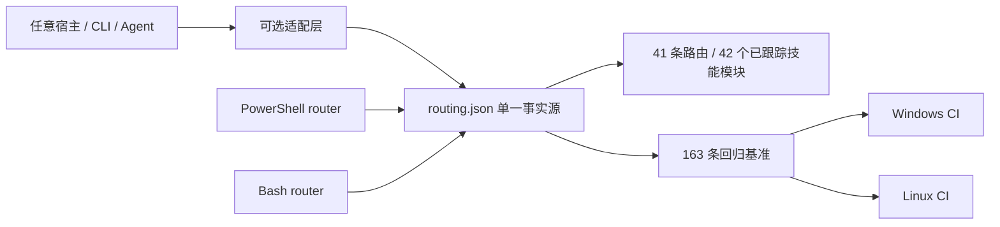

# PR #43 / #37 / #36 / #23 本地审查与集成报告

- 日期：2026-08-08
- 基线：`origin/main` at `6315d02`
- 审查分支：`codex/review-pr-43-37-36-23`
- 范围：只审查四个 PR 相对当前主线的增量价值；不执行外部目标动作
- 结论：四个 PR 均有可复用价值，但只有 #43、#37 适合保留主体；#36、#23 必须选择性集成

## 执行摘要

| PR | 相对主线价值 | 集成决定 | 关键边界 |
|---|---|---|---|
| #43 | 很高 | 保留结构化路由、163 条当前回归基准、双平台 CI、供应链 pin gate、动态索引 | 删除 OpenCode 配置、安装器和专属代理；核心不绑定任何客户端 |
| #37 | 高 | 合并 case-review、证据图审查、哈希校验与单测，并增加 R40 | 同时接受 `done` 与当前约定的 `completed` |
| #36 | 中高 | 选择性合并 Burp 重连/换行消息处理、原子 token、Anything Analyzer 鉴权、进程树与 sudo home 修复 | 拒绝“所有能力一律 ready”等语义回退 |
| #23 | 中（整包偏低） | 仅合并 Bash case-init、case-guard、结构化 Bash 路由和 CI parity | 排除 92 文件中的客户端清单、GIF、演示生成物和硬编码路由副本 |

## 平台边界

结构化路由的唯一事实源是 `skills/config/routing.json`。PowerShell 与 Bash 入口都读取该文件；宿主客户端只允许作为可选适配器存在，不能决定仓库身份、路由规则、测试基准或安装路径。

## 审查发现与修正

1. #43 的设计价值来自结构化数据与自动门禁，而不是 OpenCode 接入。所有 OpenCode 专属文件与 CI job 已移除。
2. #37 原实现只识别 `done`，会把主线使用的 `completed` 误判为未完成；已补兼容与第 7 条单测。
3. #36 的桥接重连和 token 写入是净增益；其能力状态改写会制造假阳性，未合并。
4. #23 的 Bash router 原样复制硬编码表，会立刻与 #43 的 R40/priority 漂移；已重写为读取 `routing.json`，并在 CI 校验 R1/R3/R40 parity。
5. 新 supply-chain gate 暴露 Kali manifest 的 7 个浮动安装源。已固定 Frida 14.10.4、IDA MCP commit、Agent Browser 0.31.1、ProxyCat commit、Nuclei v3.8.0、pwntools 4.15.0，并让安装命令实际使用这些 pin。
6. 推送后强制复审发现 Bash `case-init` 未继承 CaseName 路径约束；已拒绝路径、控制字符、通配符与尾随点/空格，并加入负向 CI。
7. Bash 的授权 URL 曾错误落入 `offline` 且可能 ready；已与 PowerShell 对齐为 `authorized_target_only`，明确 offline 只接受本地样本。
8. Bash `case-guard` 现只从 `auth`、`network_profile`、`signoff` 对应章节取值，notes/证据中的伪字段不能通过门禁。
9. Kali ProxyCat 固定源码安装现会生成可探测的 `~/.local/bin/proxycat` wrapper；CI checkout 也从可变 tag 固定到 v4.2.2 commit。
10. 原动态 INDEX 在开发机误收录了 12 个 `.gitignore` 排除的本地模块，干净 clone 会失败；生成器现只枚举 Git 已跟踪 skill，clean clone 与带私有扩展的工作区都稳定为 42 个核心模块。

## 相对旧主线的量化提升

使用同一组 163 条基准分别调用旧主线硬编码 router 与新结构化 router，每条均在独立 PowerShell 进程运行：

| 版本 | 通过 | 准确率 | 无输出 |
|---|---:|---:|---:|
| 旧主线 `6315d02` | 137 / 163 | 84.05% | 0 |
| 当前结构化实现 | 163 / 163 | 100% | 0 |

绝对增加 26 条正确路由、提升 15.95 个百分点。改善覆盖 Frida/Android、证书与 root 检测、抓包重放、勒索软件、Burp/Metasploit、Go 二进制、BLE、USB、native `.so`、内存 dump 等旧实现会回退 R0 的场景。

## 验证结果

| 验证项 | 结果 |
|---|---|
| 结构化路由全量回归 | 163 / 163 通过 |
| 路由一致性与供应链 pin gate | 通过 |
| PowerShell smoke | 通过 |
| P0 friction / scope-guard 回归 | 通过 |
| 旧版/新版 163 条 A/B | 137/163 → 163/163 |
| case-review Python 单测 | 7 / 7 通过 |
| Burp bridge Node 回归 | 1 / 1 通过 |
| Bash router/case-init/case-guard parity | 通过 |
| PowerShell、Bash 语法与 JSON 解析 | 通过 |
| Java 编译检查 | Gradle 8.7 分发下载被本机证书吊销网络阻塞；改用 Maven Central 的声明依赖与 JDK 21，`McpHttpServer.java` 编译通过 |

## 剩余风险

- Bash 结构化路由依赖 Python 3；这是显式运行依赖，但避免了第二份路由表。
- 固定依赖版本需要周期性、显式升级，不再隐式追随 `latest`。
- 客户端适配仍可继续扩展，但必须保持核心数据与测试完全宿主无关。
- 本机未完成 Gradle task 层测试；原因是 128 MB wrapper 分发下载受证书吊销网络与低速链路阻塞，已用同版本依赖完成改动 Java 源文件的独立编译检查。

## 最终建议

合并当前审查分支的选择性结果，不合并四个 PR 的原始整包形态。后续 PR 应按“核心路由 / 宿主适配 / 演示资产 / 文档”拆分，便于独立审查与回滚。
