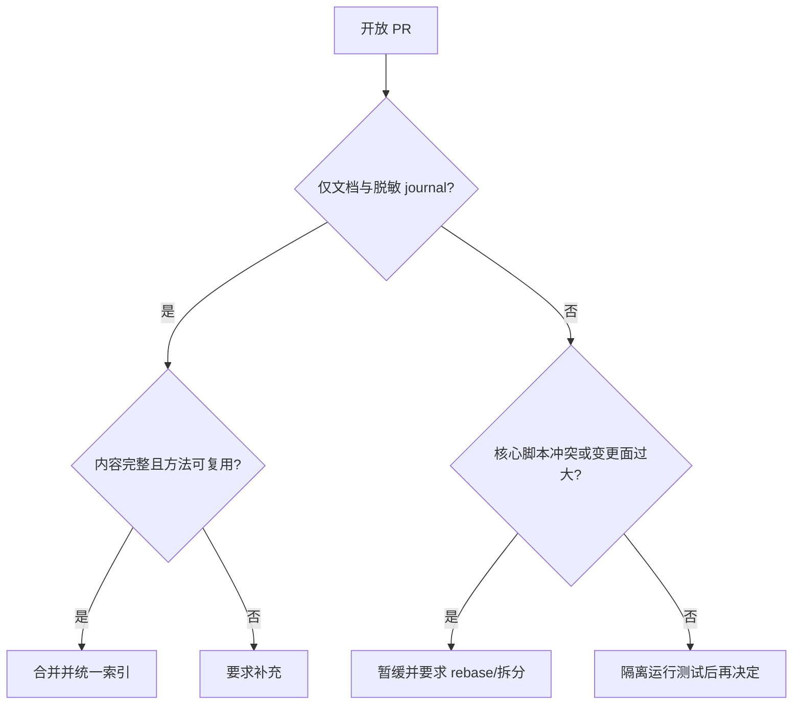

# 2026-08-08 开放 PR 价值评估与合并报告

## 结论

基于最新 `origin/main` 审查 8 个开放 PR。本轮合并 #59、#19、#22、#29；暂缓 #43、#37、#36、#23。合并后的 smoke 与 routing coherence 检查均通过。

## 评估结果

| PR | 价值 | 风险/状态 | 决策 |
|---|---|---|---|
| #59 | Rust cdylib 差分复现方法完整，可复用性高 | 仅 journal 与索引，无可执行代码 | 合并 |
| #19 | Windows 24H2 工具链兼容经验覆盖广 | 仅 journal 与索引 | 合并 |
| #22 | Electron/Bytenode/更新链分析方法完整 | 仅 journal 与索引 | 合并 |
| #29 | Next.js 双 API serializer 与契约重建经验完整 | 仅 journal 与索引 | 合并 |
| #43 | 路由单一事实源、回归基准、CI 与版本固定价值很高；客户端接入只能作为可选适配层 | 38 文件、与主线 4 个关键文件冲突，原提案含 OpenCode 专用配置 | 暂缓，建议 rebase 后专项审查；不得让核心绑定 OpenCode |
| #37 | evidence graph/case review 能补齐交付审计 | 与主线路由校验和文档冲突 | 暂缓，建议 rebase 后运行其单测 |
| #36 | MCP/自举安全加固方向正确 | 6 个关键文件冲突，部分能力已由近期主线吸收 | 暂缓，做差分去重 |
| #23 | Bash parity 与展示材料有生态价值 | 92 文件、展示资产多、2 个脚本冲突 | 暂缓，建议拆分 PR |

## 决策图

## 验证

- `skills/scripts/smoke.ps1`: ALL PASS（9 个脚本解析、8 个路由用例）。
- `skills/scripts/verify-routing-coherence.ps1`: ALL ROUTING COHERENCE CHECKS PASSED。
- 用户原有未提交 journal 在同步和合并期间通过 stash 隔离保存并恢复。

## 后续建议

1. 优先让 #43 rebase 到当前 `main`，重点复核 JSON 路由等价性、供应链 pin gate 与跨平台路径。
2. 让 #37 单独 rebase，并运行 `skills/case-review/tests/test_review_case.py`。
3. 对 #36 与已合并的安全修复逐文件比较，只提取尚未覆盖的测试或边界处理。
4. 将 #23 拆成 Bash parity、插件元数据、演示资产三个独立 PR。
